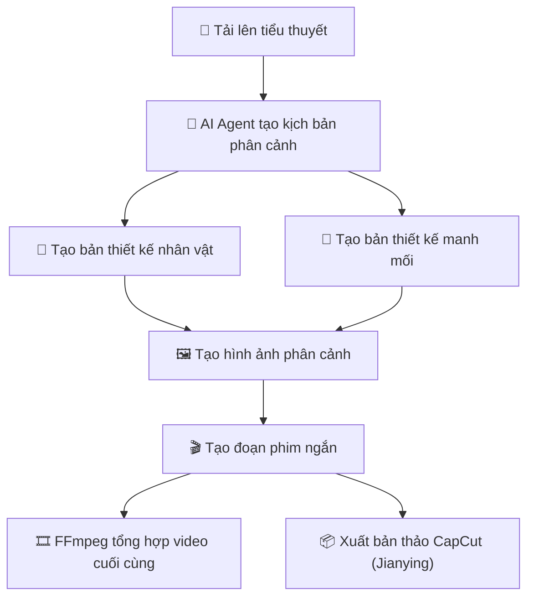
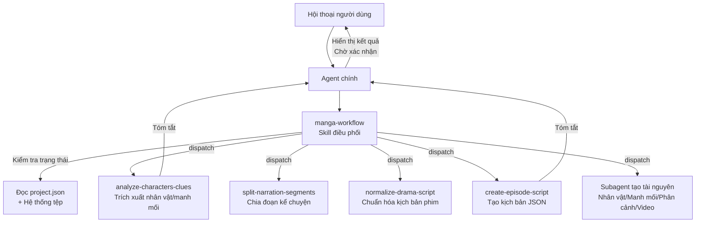
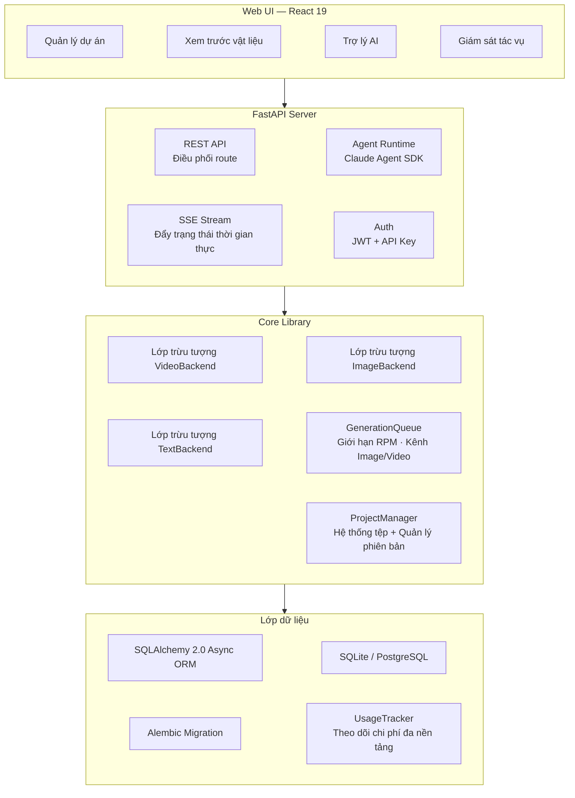

<h1 align="center">
  <br>
  <picture>
    <source media="(prefers-color-scheme: light)" srcset="frontend/public/android-chrome-maskable-512x512.png">
    <source media="(prefers-color-scheme: dark)" srcset="frontend/public/android-chrome-512x512.png">
    
  </picture>
  <br>
  ArcReel
  <br>
</h1>

<h4 align="center">Xưởng tạo Video AI mã nguồn mở — Từ tiểu thuyết đến video ngắn, vận hành hoàn toàn bằng AI Agent</h4>
<h5 align="center">Open-source AI Video Generation Workspace — Novel to Short Video, Powered by AI Agents</h5>

<p align="center">
  <a href="#bắt-đầu-nhanh"></a>
  <a href="https://github.com/ArcReel/ArcReel/blob/main/LICENSE"></a>
  <a href="https://github.com/ArcReel/ArcReel"></a>
  <a href="https://github.com/ArcReel/ArcReel/pkgs/container/arcreel"></a>
  <a href="https://github.com/ArcReel/ArcReel/actions/workflows/test.yml"></a>
</p>

<p align="center">
  
  
  
  
  
  
  
  
</p>

<p align="center">
  
</p>

---

## Năng lực cốt lõi

<table>
<tr>
<td width="20%" align="center">
<h3>🤖 Luồng công việc AI Agent</h3>
Dựa trên <strong>Claude Agent SDK</strong>, điều phối Skill + tập trung Subagent cộng tác đa nhân tố, tự động hoàn thành quy trình từ sáng tác kịch bản đến tổng hợp video.
</td>
<td width="20%" align="center">
<h3>🎨 Tạo hình ảnh đa nền tảng</h3>
Hỗ trợ <strong>Gemini</strong>, <strong>ByteDance Ark</strong>, <strong>Grok</strong>, <strong>OpenAI</strong> và các nhà cung cấp tùy chỉnh. Thiết kế nhân vật đảm bảo tính nhất quán, theo dõi manh mối đảm bảo đạo cụ/cảnh quay liền mạch giữa các khung hình.
</td>
<td width="20%" align="center">
<h3>🎬 Tạo video đa nền tảng</h3>
Hỗ trợ <strong>Veo 3.1</strong>, <strong>Seedance</strong>, <strong>Grok</strong>, <strong>Sora 2</strong> và các nhà cung cấp tùy chỉnh, có thể chuyển đổi linh hoạt ở cấp độ toàn cục hoặc dự án.
</td>
<td width="20%" align="center">
<h3>⚡ Hàng chờ tác vụ bất đồng bộ</h3>
Giới hạn tốc độ RPM + Kênh hình ảnh/video độc lập, điều phối dựa trên lease-based, hỗ trợ tiếp tục tác vụ từ điểm dừng (checkpoint).
</td>
<td width="20%" align="center">
<h3>🖥️ Xưởng làm việc trực quan</h3>
Giao diện Web UI quản lý dự án, xem trước tài nguyên, hoàn tác phiên bản, theo dõi tác vụ thời gian thực qua SSE, tích hợp sẵn trợ lý AI.
</td>
</tr>
</table>

## Quy trình làm việc



## Bắt đầu nhanh

### Triển khai mặc định (SQLite)

```bash
git clone https://github.com/nguyenanhfr/ArcReel.git
cd ArcReel/deploy
cp .env.example .env
docker compose up -d
# Truy cập http://localhost:1241
```

### Triển khai sản xuất (PostgreSQL)

```bash
cd ArcReel/deploy/production
cp .env.example .env    # Cần thiết lập POSTGRES_PASSWORD
docker compose up -d
```

Sau khi khởi động lần đầu, đăng nhập bằng tài khoản mặc định:

> [!IMPORTANT]
> **Tên đăng nhập:** `admin` / **Mật khẩu:** `admin`

_(Mật khẩu trong `.env` được thiết lập qua `AUTH_PASSWORD`; nếu chưa thiết lập, hệ thống sẽ tự động tạo và ghi lại vào `.env` khi chạy lần đầu)._

Sau đó đi tới **Trang cài đặt** (`/settings`) để hoàn tất cấu hình:


1. **ArcReel Agent** — Cấu hình Anthropic API Key (để vận hành trợ lý AI), hỗ trợ tùy chỉnh Base URL và Model.
2. **AI Tạo hình ảnh/video** — Cấu hình API Key của ít nhất một nhà cung cấp (Gemini / ByteDance / Grok / OpenAI), hoặc thêm nhà cung cấp tùy chỉnh.

> 📖 Để biết chi tiết các bước, vui lòng tham khảo [Hướng dẫn bắt đầu đầy đủ](docs/getting-started.md)

## Tính năng đặc sắc

- **Quy trình sản xuất trọn gói** — Từ tiểu thuyết → Kịch bản → Thiết kế nhân vật → Hình ảnh phân cảnh → Đoạn video → Video hoàn thiện, điều phối chỉ với một cú nhấp.
- **Kiến trúc đa nhân tố (Multi-agent)** — Điều phối Skill để kiểm tra trạng thái dự án và tự động phân công Subagent tập trung. Mỗi Subagent hoàn thành một nhiệm vụ độc lập và trả về tóm tắt.
- **Hỗ trợ đa nhà cung cấp** — Tạo hình ảnh/video/văn bản hỗ trợ 4 nhà cung cấp lớn: Gemini, ByteDance Ark, Grok, OpenAI, có thể chuyển đổi linh hoạt.
- **Nhà cung cấp tùy chỉnh** — Kết nối bất kỳ API nào tương thích OpenAI / Google (như Ollama, vLLM, trung gian bên thứ ba), tự động phát hiện model khả dụng và phân loại loại phương tiện.
- **Hai chế độ nội dung** — Chế độ kể chuyện (narration) chia đoạn theo nhịp đọc, chế độ phim hoạt hình (drama)按场景/对话结构组织。
- **Lập kế hoạch tập phim lũy tiến** — Phối hợp người và máy để chia tiểu thuyết dài: Peek thăm dò → Agent gợi ý điểm ngắt → Người dùng xác nhận → Cắt vật lý.
- **Hình ảnh tham chiếu phong cách** — Tải lên ảnh phong cách, AI tự động phân tích và áp dụng đồng nhất cho toàn bộ hình ảnh được tạo.
- **Nhân vật nhất quán** — AI tạo bản thiết kế nhân vật trước, tất cả phân cảnh và video sau đó đều tham chiếu theo thiết kế này.
- **Theo dõi manh mối** — Các đạo cụ quan trọng, yếu tố cảnh nền được đánh dấu là "manh mối", duy trì sự liền mạch thị giác qua các cảnh quay.
- **Lịch sử phiên bản** — Mỗi lần tạo lại đều tự động lưu phiên bản lịch sử, hỗ trợ phục hồi (rollback) nhanh.
- **Theo dõi chi phí đa nền tảng** — Hình ảnh/video/văn bản đều được đưa vào tính toán chi phí, thống kê theo từng nhà cung cấp và loại tiền tệ.
- **Xuất bản thảo CapCut (Jianying)** — Xuất tệp ZIP bản thảo CapCut theo từng tập, hỗ trợ CapCut 5.x / 6+ ([Hướng dẫn vận hành](docs/jianying-export-guide.md)).
- **Nhập/Xuất dự án** — Đóng gói và lưu trữ toàn bộ dự án để sao lưu hoặc di chuyển dễ dàng.

## Nhà cung cấp hỗ trợ

ArcReel hỗ trợ nhiều nhà cung cấp thông qua giao thức thống nhất `ImageBackend` / `VideoBackend` / `TextBackend`:

### Nhà cung cấp hình ảnh

| Nhà cung cấp | Model khả dụng | Khả năng | Phương thức tính phí |
|--------------|----------------|----------|----------------------|
| **Gemini** (Google) | Imagen 2, Imagen Pro | Văn bản sang ảnh, Ảnh sang ảnh (đa tham chiếu) | Theo độ phân giải (USD) |
| **ByteDance Ark** | Seedream 5.0, 5.0 Lite, 4.5, 4.0 | Văn bản sang ảnh, Ảnh sang ảnh | Theo số lượng ảnh (CNY) |
| **Grok** (xAI) | Grok Imagine Image, Image Pro | Văn bản sang ảnh, Ảnh sang ảnh | Theo số lượng ảnh (USD) |
| **OpenAI** | DALL-E 3 | Văn bản sang ảnh | Theo số lượng ảnh (USD) |

### Nhà cung cấp video

| Nhà cung cấp | Model khả dụng | Khả năng | Phương thức tính phí |
|--------------|----------------|----------|----------------------|
| **Gemini** (Google) | Veo 3.1, 3.1 Fast, 3.1 Lite | Văn bản/Ảnh sang video, Mở rộng video, Negative prompt | Theo độ phân giải × thời lượng (USD) |
| **ByteDance Ark** | Seedance 2.0, 2.0 Fast, 1.5 Pro | Văn bản/Ảnh sang video, Mở rộng video, Tạo âm thanh | Theo lượng token (CNY) |
| **Grok** (xAI) | Grok Imagine Video | Văn bản sang video, Ảnh sang video | Theo thời lượng giây (USD) |
| **OpenAI** | Sora 2, Sora 2 Pro | Văn bản sang video, Ảnh sang video | Theo thời lượng giây (USD) |

### Nhà cung cấp văn bản

| Nhà cung cấp | Model khả dụng | Khả năng | Phương thức tính phí |
|--------------|----------------|----------|----------------------|
| **Gemini** (Google) | Gemini 1.5 Flash, 1.5 Pro | Tạo văn bản, Structured Outputs, Hiểu thị giác | Theo lượng token (USD) |
| **ByteDance Ark** | Doubao Seed series | Tạo văn bản, Structured Outputs, Hiểu thị giác | Theo lượng token (CNY) |
| **Grok** (xAI) | Grok 2.0, Grok 2.0 Fast | Tạo văn bản, Structured Outputs, Hiểu thị giác | Theo lượng token (USD) |
| **OpenAI** | GPT-4o, GPT-4o mini | Tạo văn bản, Structured Outputs, Hiểu thị giác | Theo lượng token (USD) |

## Kiến trúc Trợ lý AI

Trợ lý AI của ArcReel được xây dựng trên **Claude Agent SDK**, sử dụng kiến trúc điều phối **Skill + Subagent**:



**Nguyên tắc thiết kế cốt lõi**:
- **Skill điều phối (manga-workflow)** — Có khả năng kiểm tra trạng thái, tự động xác định giai đoạn hiện tại của dự án để phân công Subagent tương ứng.
- **Subagent tập trung** — Mỗi Subagent chỉ hoàn thành một nhiệm vụ duy nhất. Nội dung tiểu thuyết lớn được giữ trong Subagent, Agent chính chỉ nhận tóm tắt tinh gọn để bảo vệ không gian ngữ cảnh.
- **Xác nhận giữa các giai đoạn** — Sau khi Subagent trả về, Agent chính hiển thị kết quả cho người dùng và chờ xác nhận trước khi chuyển sang giai đoạn tiếp theo.

## Tích hợp OpenClaw

ArcReel hỗ trợ gọi qua các nền tảng AI Agent bên ngoài như [OpenClaw](https://openclaw.ai), giúp tạo video bằng ngôn ngữ tự nhiên:
1. Tạo API Key (tiền tố `arc-`) tại trang cài đặt ArcReel.
2. Tải định nghĩa Skill của ArcReel trong OpenClaw (truy cập `http://your-domain/skill.md` để lấy tự động).
3. Hội thoại qua OpenClaw để tạo dự án, kịch bản và video.

## Kiến trúc kỹ thuật



## Công nghệ sử dụng

| Tầng | Công nghệ |
|------|-----------|
| **Frontend** | React 19, TypeScript, Tailwind CSS 4, wouter, zustand, Framer Motion, Vite |
| **Backend** | FastAPI, Python 3.12+, uvicorn, Pydantic 2 |
| **AI Agent** | Claude Agent SDK (Kiến trúc đa nhân tố Skill + Subagent) |
| **ORM & DB** | SQLAlchemy 2.0 (async), Alembic, SQLite (mặc định) / PostgreSQL |
| **Xử lý đa phương tiện** | FFmpeg, Pillow |
| **Triển khai** | Docker, Docker Compose |

## Tài liệu

- 📖 [Hướng dẫn bắt đầu đầy đủ](docs/getting-started.md)
- 📦 [Hướng dẫn xuất bản thảo CapCut](docs/jianying-export-guide.md)
- 💰 [Tham chiếu phí Google GenAI](docs/google-genai-docs/Google视频&图片生成费用参考.md)
- 💰 [Tham chiếu phí ByteDance Ark](docs/ark-docs/火山方舟费用参考.md)

## Đóng góp

Rất hoan nghênh bạn đóng góp mã nguồn, báo cáo lỗi hoặc đề xuất tính năng mới!

### Môi trường phát triển cục bộ

```bash
# Yêu cầu: Python 3.12+, Node.js 20+, uv, pnpm, ffmpeg

# Cài đặt phụ thuộc
uv sync
cd frontend && pnpm install && cd ..

# Khởi tạo database
uv run alembic upgrade head

# Chạy Backend (Terminal 1)
uv run uvicorn server.app:app --reload --port 1241

# Chạy Frontend (Terminal 2)
cd frontend && pnpm dev
```

---

<p align="center">
  Nếu bạn thấy dự án này hữu ích, hãy tặng cho chúng tôi một ⭐ Star để ủng hộ nhé!
</p>